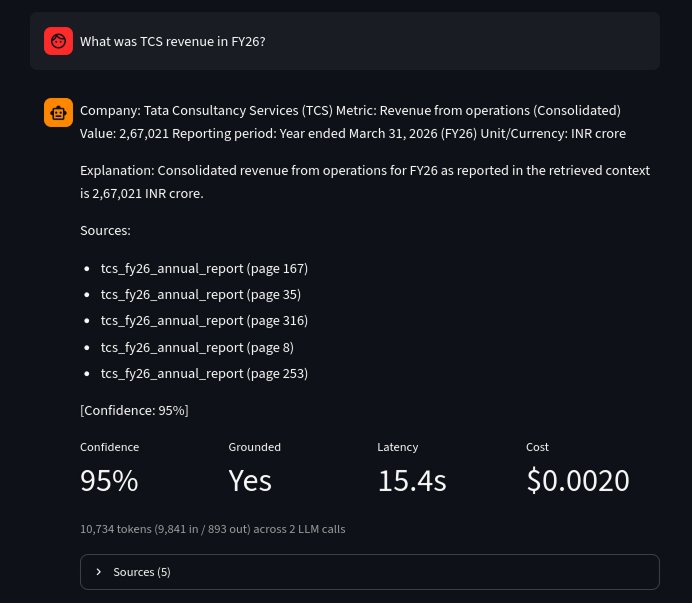
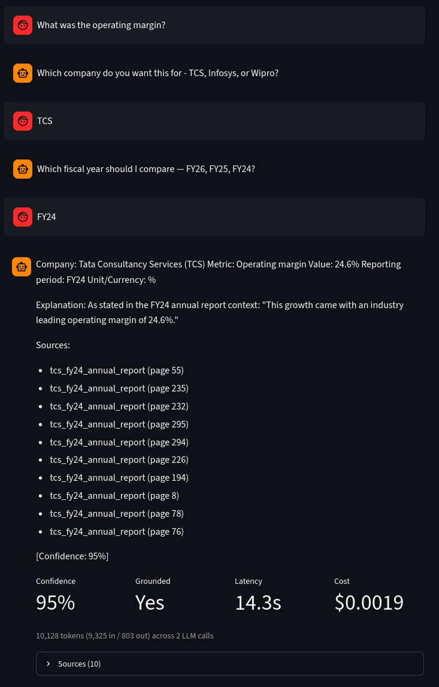
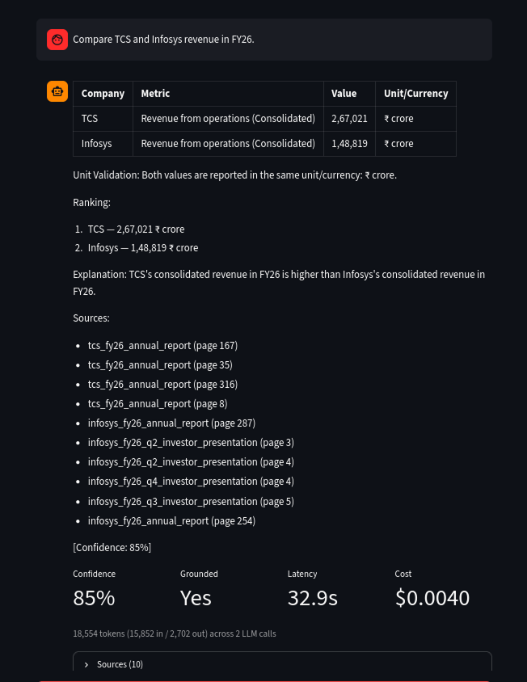
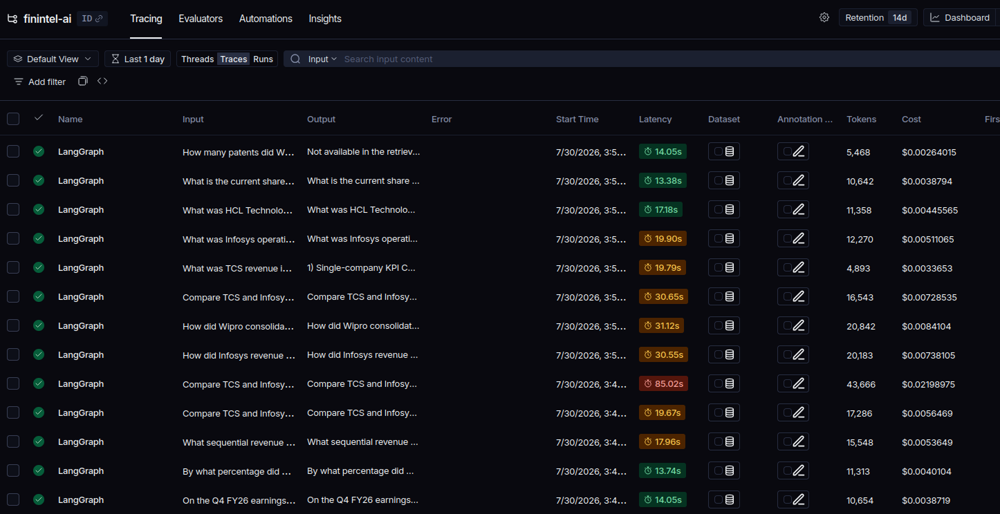
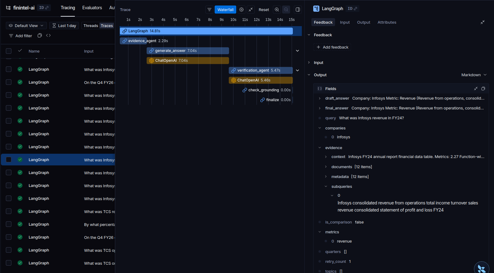
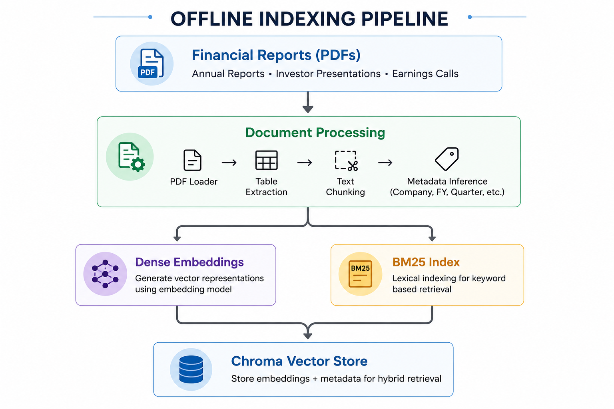
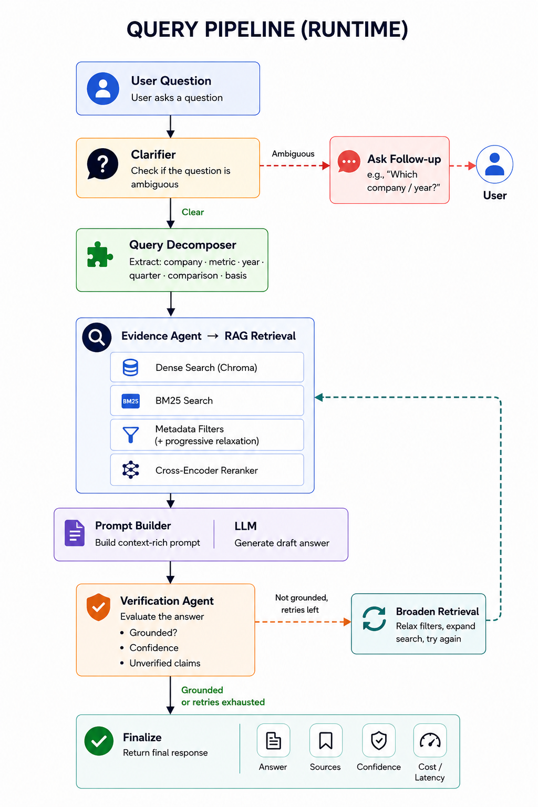
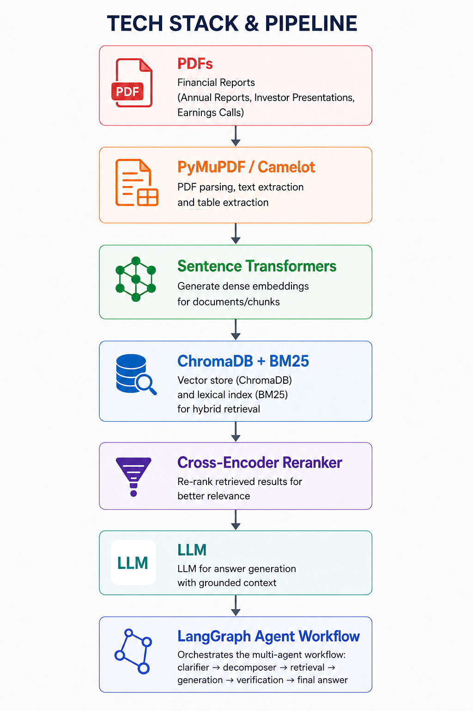

# FinIntel AI


**A retrieval-augmented financial analyst for Indian IT-services filings, with a verification agent, a 52-question evaluation harness, and full cost/latency observability.**

🔗 **Live demo:** https://finintelai.streamlit.app

Ask natural-language questions about the annual reports, investor presentations, and earnings-call transcripts of TCS, Infosys, and Wipro (FY24–FY26). Every answer is grounded strictly in the source filings, independently fact-checked, and returned with its confidence, sources, latency, and per-query cost.

> **Scope note:** This is a demo over **3 companies × 3 years**. The focus is answer correctness under financial nuance, standalone vs consolidated, reported vs constant-currency, full-year vs quarterly, attributable vs total profit.

---

# Performance Highlights

Accuracy on a hand-built, source-verified evaluation set improved from a **77% baseline to 89%** through root-cause retrieval and routing fixes.

| Category | Score |
| :--- | :--- |
| `single_year_fact` | **9/9 (100%)** |
| `constant_currency` | **3/3 (100%)** |
| `guidance` | **2/2 (100%)** |
| `narrative` | **3/3 (100%)** |
| `unanswerable` | **5/5 (100%)** |
| `single_fact` | **9/10 (90%)** |
| `quarterly` | **8/9 (89%)** |
| `table_sourced` | **5/6 (83%)** |
| `comparison` | **3/5 (60%)** |

- **Hallucination rate:** **0/5** on unanswerable questions — the system refuses cleanly (*"not available in the retrieved context"*) rather than fabricating figures.
- **Per-company:** **TCS:** 16/16 · **Infosys:** 14/15 · **Wipro:** 13/15

---

# Demo

### Single-Company Question

<p align="center">
  
</p>

### Clarification Before Retrieval

<p align="center">
  
</p>

### Cross-Company Comparison

<p align="center">
  
</p>

### LangSmith Trace

<p align="center">
  
</p>

### Individual Execution Trace

<p align="center">
  
</p>

Each answer surfaces confidence, grounded status, latency, per-query cost, and sources. Ambiguous questions (*"What was the revenue?"*) trigger a clarification (*"Which company - TCS, Infosys, or Wipro?"*) instead of a guess.

---

# Architecture

A LangGraph agent pipeline with a verification loop.

### Offline Indexing Pipeline

<p align="center">
  
</p>

### Runtime Query Pipeline

<p align="center">
  
</p>

### Technology Stack

<p align="center">
  
</p>

1. **Query decomposition:** A rule-based decomposer resolves the company, metric, fiscal period, and reporting basis (standalone/consolidated, reported/constant-currency), then builds expanded retrieval sub-queries. Company memory carries context across turns for follow-ups.

2. **Retrieval:** Hybrid dense (ChromaDB + bge-small) and sparse (BM25) search, with a cross-encoder reranker (`ms-marco-MiniLM`, adaptive top-k widened for comparisons), plus a progressive filter-relaxation cascade that falls back gracefully when a strict metadata filter returns nothing.

3. **Answer generation:** An LLM answers strictly from retrieved context, following explicit disambiguation rules (period, basis, line-item).

4. **Verification:** A second LLM independently checks the draft for both existence (the value is in the context) and relevance (it matches the company, period, and metric asked). Ungrounded answers trigger a bounded retry with broadened retrieval.

5. **Clarification layer:** Asks the user for the company or fiscal year when a question is ambiguous, before any retrieval runs.

---

## What Moved the Number (77% → 89%)

Each fix targeted a class of failures, verified against the eval harness:

* **Statement-type routing:** Standalone queries were being filtered toward consolidated chunks; detecting the qualifier and routing to standalone-tagged chunks fixed the standalone class.
* **Query-classification bug:** *"...Services business"* questions misrouted to generic company-overview retrieval because *"business"* was an over-greedy classification keyword. Fixing it took the `narrative` category from **67% → 100%**.
* **Constant-currency routing:** CC figures live in earnings-call transcripts, not annual reports; adding CC retrieval vocabulary took the `constant_currency` category from **33% → 100%**.
* **Superlative comparison routing:** *"Which company had the highest revenue"* now compares across all companies instead of asking *"Which company?"* and collapsing to one.
* **Progressive filter relaxation:** Replaced a two-step filter fallback with a cascade that relaxes filters group by group and ultimately falls back to unfiltered search, so a too-strict filter never returns an empty result.
* **Table-chunk enrichment:** Number-grid table chunks (mostly digits) were nearly invisible to retrieval; prepending a descriptive text prefix made them retrievable.

---

## Observability

* **LangSmith tracing:** Every run is traced end to end (retrieval → generation → verification), with per-call token counts, cost, and latency percentiles. Enabled via a single `wrap_openai` on the client.
* **In-app instrumentation:** Each answer reports its token usage, estimated cost, and wall-clock latency, so the unit economics of every query are visible.

---

## Evaluation Methodology

The eval set (`src/eval/eval_questions.json`) contains **52 questions across 9 categories**, each with a source-verified expected answer, expected source document, and a note documenting the exact figure and any near-miss values to disambiguate from.

Answerable questions are scored on both value match and whether the correct source was retrieved; unanswerable questions are scored on whether the system correctly declines. Results are written per-run to `eval/results/` for comparison across changes.

### Run it

```bash
python -m src.eval.runner src/eval/eval_questions.json
```

---

## Running Locally

```bash
# 1. Install dependencies
pip install -r requirements.txt

# 2. Set credentials in .env
# AZURE_OPENAI_API_KEY
# AZURE_OPENAI_ENDPOINT
# AZURE_OPENAI_API_VERSION
# AZURE_OPENAI_DEPLOYMENT

# 3. Build or rebuild the vector store
python -m src.app.main --reset

# 4a. Terminal Chat
python -m src.app.chat

# 4b. Streamlit UI
streamlit run streamlit_app.py

# 4c. FastAPI
uvicorn src.api.main:app --port 8000
```

---

## Tech Stack

- **Orchestration:** LangGraph
- **Retrieval:** ChromaDB + BM25 + Cross-Encoder Reranker
- **Embeddings:** `BAAI/bge-small-en-v1.5`
- **Reranker:** `cross-encoder/ms-marco-MiniLM-L6-v2`
- **LLM:** Azure OpenAI (`gpt-5-mini`)
- **Serving:** FastAPI · Streamlit
- **Observability:** LangSmith
- **Ingestion:** pdfplumber · PyMuPDF · Camelot

---

## Limitations & Future Work

1. **Wrong-line-item extraction:** The remaining failures are mostly cases where retrieval surfaces the correct document but the model selects an adjacent figure (large-deal vs total TCV, attributable vs total profit, segment vs consolidated total). The verifier reliably catches wrong company/period/metric-category, but not fine-grained line-item variants.

2. **Cross-company unit normalization:** Wipro reports in ₹ million while TCS/Infosys report in ₹ crore. The system currently declines to rank across mismatched units rather than converting them.

3. **Confidence calibration:** The verifier emits confidence scores; calibrating them against the evaluation set is planned future work.